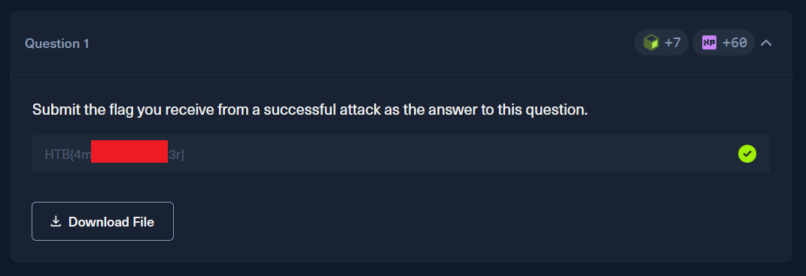

# HackTheBox — AI Data attacks (Skills Assessment)

**Platform:** [HackTheBox Academy](https://academy.hackthebox.com)

**Room:** AI Data attacks (Skills Assessment)

---

## Overview

It is the last page of AI Data attacks module. In this lab we should manipulate model's training data to achieve a specific, nuanced misclassification behavior. The goal is to poison its training dataset using only label flipping such that the subsequently trained model exhibits ambiguous classification for instances of Class 1. In other words, when the poisoned model encounters new data points that genuinely belong to Class 1, it should frequently misclassify them as either Class 0 or Class 2, degrading the classification accuracy of Class 1.

It only has one question:

---

## Approach

You can find full code in the file ["skills-assessment-student-template.ipynb"](./skills-assessment-student-template.ipynb). I added only one function to a provided notebook template. All logic for this attack happens in "flip_labels" function. It is a modified function from "The Label Flipping Attack" section that is tuned to target only Class 1 and change its labels to Class 0 or Class 2.

This notebook has pretty descriptive comments that explains how everything works.

The core logic is as follows:

The function takes a label array y and a poison_percentage, then flips a calculated portion of Class 1 labels to either Class 0 or Class 2 at random. It first counts how many Class 1 instances exist, derives how many to flip, then iterates through the array sequentially — flipping each Class 1 label it encounters until the target count is reached.

**Important note:**

*The function flips the first N Class 1 instances it encounters rather than a random sample — not ideal, but it works fine for this lab.* 

*Ideally the flipped labels should be spread randomly across the dataset, but since we always flip the first N instances, we may end up poisoning only one "corner" of Class 1.*