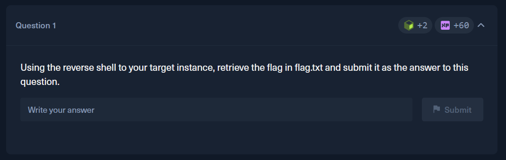
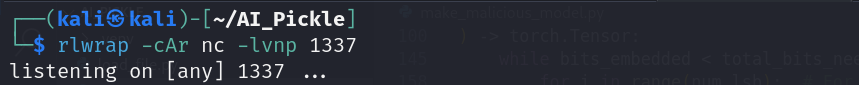
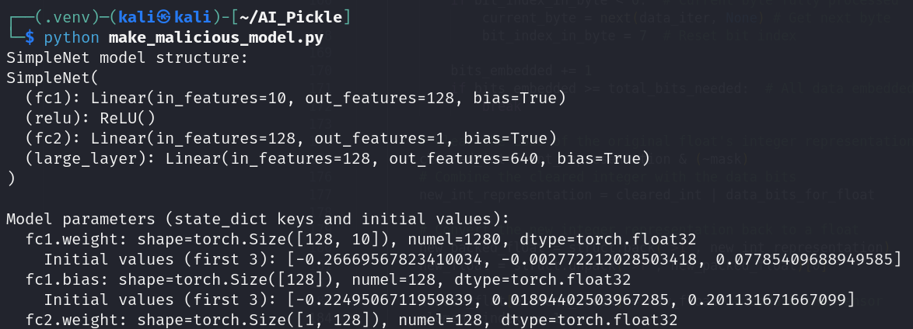
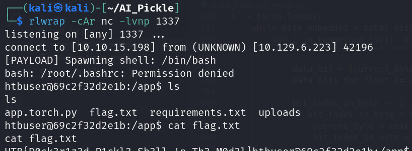

# HackTheBox — Pickles and Steganography

**Platform:** [HackTheBox Academy](https://academy.hackthebox.com)

**Room:** Pickles and Steganography (Execute the Attack)

---

## Overview

This lab demonstrates how a malicious actor can weaponize a PyTorch model file by embedding a hidden reverse shell payload inside layer weights using LSB (Least Significant Bit) steganography, then triggering its execution via Python's pickle deserialization vulnerability — simulating a real-world ML supply chain attack.

It only has one question:

---

## Approach

You can find full code in the file "create_malicious_model.py". Basicaly it consists of provided code and compilation of examples in previous sections. It has pretty descriptive comments that explains how everything works.

## Steps

### Step 1:
Write script that will create malicious model with a hiden payload. You can use "create_malicious_model.py". **Do not forget to change IP adresses in code.**

### Step 2:
Launch listener. Make sure you are connected to a VPN and your target is reacheble. 

### Step 3:
Run python script to create and send a malicious model to your target.

### Step 4:
Check your listener for incoming connections and print flag from "flag.txt"

