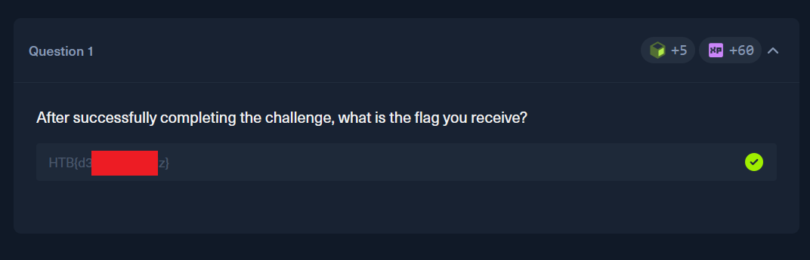

# HackTheBox — AI Evasion - First-Order Attacks (DeepFool Challenge)

**Platform:** [HackTheBox Academy](https://academy.hackthebox.com)

**Room:** AI Evasion - First-Order Attacks (DeepFool Challenge)

---

## Overview

DeepFool is a gradient-based adversarial attack, but unlike FGSM, it doesn't try to maximize loss. Instead, it looks for the smallest possible change to the input that's enough to flip the model's prediction.

It does this by treating the model's decision boundary as roughly flat nearby, and calculating the shortest path to push the input across it. Since the real boundary is actually curved, one step usually isn't enough — so DeepFool repeats the process, step by step, until the prediction actually changes. A small overshoot value is added to make sure it fully crosses the boundary, not just gets close.

The task is to craft an adversarial example that fools an MNIST digit classifier using DeepFool, with an L2 norm threshold: the attack only counts as successful if the perturbation stays within that limit, so the image doesn't change more than necessary.

Task:



---

## Approach

In the lab description we are provided with an API documentation and simple Python code we can use to start interacting with challenges.

__You can find full notebook with a solution here: "[deepfool_challenge.ipynb](./deepfool_challenge.ipynb)".__

First I added that code to my Python notebook. I imported modules and downloaded challenge information. Also I downloaded weights and implemented the model architecture that is used on a server side. To compute gradients with respect to the input pixels, I needed a local copy of the model — the server-side classifier is a black box that only returns predictions, not gradients. Thankfully author provided architecture that I could use. 

After checks that my local model and server side clasiffier workeed as expected, I moved on straight to implementing the attack.

I wrote a separate function for this attack. It is the function from "DeepFool Implementation" theory page, but with a few tweeks. First thing I changed was working with candidate classes. Instead of computing steps for all digits except its true label, it was changed to compute steps only for target class.

That part of code gone from this:
```python
if I[k] == label:
    continue
```

to this:
```python
if I[k] != target_class: # Search minimal step only for target class
    continue
```

Also I had to change how main loop of the attack stops. Instead of stoping whenewer prediction fliped to other label, I made it to stop only when prediction fliped to label of target class and L2 norm of pertrubed image was close enough to a threshold. I had to add the check for a threshold, because without it, the server-side validator would reject the perturbation as either too large or, after quantization rounding errors, no longer sufficient to reliably cross the decision boundary with a simple fixed overshoot.

That part of code gone from this:
```python
# Stop when the prediction changes
if k_i != label:
    break
```

to this:
```python
# Stop when the prediction changes to target class
if k_i == target_class:
    orig_image_np = image.clone().detach().cpu().numpy().squeeze()
    pert_image_np = x.clone().detach().cpu().numpy().squeeze()
    l2_attack = l2(orig_image_np, pert_image_np)
    if(l2_attack >= thr*0.98): # Stop only if we are close to l2 norm treshhold 
        break
```

After that there are nothing interesting. I just used provided functions to pass the perturbed image to the server side classifier. It worked. I got a flag. 