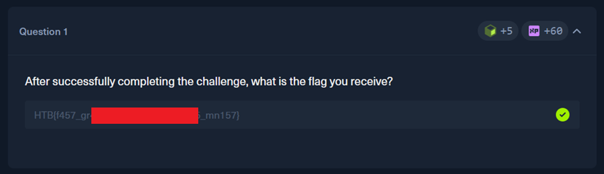

# HackTheBox — AI Evasion - First-Order Attacks (FGSM Challenge)

**Platform:** [HackTheBox Academy](https://academy.hackthebox.com)

**Room:** AI Evasion - First-Order Attacks (FGSM Challenge)

---

## Overview

Fast Gradient Sign Method (FGSM) is one of the simplest adversarial attacks on neural networks, that tweaks the input to maximize the loss — making the model as wrong as possible.

A neural network learns by calculating a loss (how wrong it is) and then adjusting its weights using gradients. Normally, you update the weights to reduce the loss.
FGSM does the opposite: it keeps the weights frozen and instead tweaks the input to make the model as wrong as possible.

The task is to craft an adversarial example that fools an MNIST digit classifier using the Fast Gradient Sign Method.

Task:



---

## Approach

In the lab description we are provided with an API documentation and simple Python code we can use to start interacting with challenges.

__You can find full notebook with a solution here: "[attack,ipynb](./FGSM.ipynb)".__

First I added that code to my Python notebook. I imported modules and downloaded challenge information. Also I downloaded weights and implemented the model architecture that is used on a server side. To compute gradients with respect to the input pixels, I needed a local copy of the model — the server-side classifier is a black box that only returns predictions, not gradients. Thankfully author provided architecture that I could use. 

After checks that my local model and server side clasiffier workeed as expected, I moved on straight to implementing the attack.

I wrote a separate function for this attack. The function nudges image pixels step by step in the direction that breaks the model, while making sure the total change stays small enough to be invisible.

Basicaly, it is a iterative version of FGSM. The whole point of it was not to make one big change, but divide a perturbation limit and apply small changes for each step.

I want to bring extra attention to this line of code:

```alpha = (epsilon / num_iter) * 0.97```

First I tried to compute alpha without multiplication by 0.97, but server side validator kept saying that I perturbed the image too much. I do not know why exactly it behaved like that, but I guess it comes from rounding errors. That is why I used multiplication by 0.97 to compensate for that.

In the end there are nothing interesting. I just used provided functions to pass the perturbed image to the server side classifier. It worked. I got a flag. 