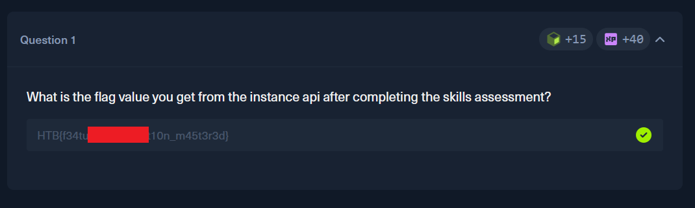

# HackTheBox — AI Evasion - Foundations (Skills assesment: Feature Obfuscation Attack)

**Platform:** [HackTheBox Academy](https://academy.hackthebox.com)

**Room:** AI Evasion - Foundations (Skills assesment: Feature Obfuscation Attack)

---

## Overview

In this lab we are required to implement Good Words attack on a two different ML classifier of movie reviews. This lab has two phases: whitebox and blackbox testing. In the first phase we have full access to the classifier. In the second part of this lab we have to interact with the classifier through API.

We have different constrains for each phase.

Phase 1: White-Box Attack

    - Objective: Flip the sentiment of 10 positive movie reviews to negative.
    
    - Resources: Full access to download and analyze the model.
    
    - Constraints: Add up to a maximum of 30 words per review.

Phase 2: Black-Box Attack

    - Objective: Flip the sentiment of 10 negative movie reviews to positive.
    
    - Resources: Limited to black-box API queries; no direct model access.
    
    - Constraints: Add up to a maximum of 40 words per review.

Task:

---

## Approach

In the lab description we are provided with an API documentation and simple Python code we can use to start interacting with challenges.

__You can find full notebook with a solution here: "[attack,ipynb](./attack.ipynb)".__

Fist I added that code to my Python notebook. I imported modules and downloaded model file of a classifier. 

Then I started first challenge.

Since I had full access to the model internals, the first thing I did was pull out the classifier's learned probabilities for every word in its vocabulary. This told me exactly which words the model associates with negative sentiment.

I then ranked all vocabulary words by a simple "negativeness" score by comparing conditional probabilities. The top 100 words from that ranking became my candidate payload.

From there, the idea was straightforward — just append those negative-leaning words to the end of every positive review and see if the model changes its decision. I didn't touch the original text at all, just added words at the end.

To figure out the right payload size, I swept through different amounts — from 0 up to 30 injected words — and measured what percentage of positive reviews successfully flipped to negative at each step. It is pointless to go beyond 30 appended words, because we have constrains in this lab.

Finally, I saved every review that was successfully flipped. Some reviews appeared more than once, so I kept only one copy of each. Then I sent the final list to the API.

Then I started second phase with a black box model.

I used the list with negativeness scores from the first phase. Because in this phase all negative reviews must predict as positive, I took 80 words with the smallest negativeness scores as my candidate words.

After that my code looks very similar to a [previous lab](../ai-evasions-goodwords/readme.md). 
First it measures how much each candidate word increases the positive review probability when appended to the base message. Then it sorts words by their impact score and keeps only best 40 words. Then it appends words one by one, stopping as soon as the model flips its label to "positive" or we hit a limit of 40 added words.

Finally, I saved every review that was successfully flipped. Some reviews appeared more than once, so I kept only one copy of each. Then I sent the final list to the API.