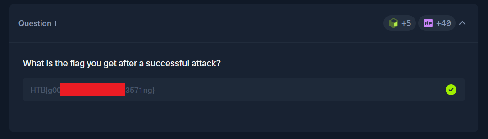
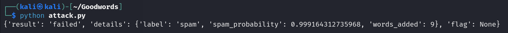
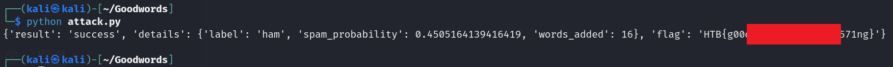

# HackTheBox — AI Evasion - Foundations (GoodWords Challenge)

**Platform:** [HackTheBox Academy](https://academy.hackthebox.com)

**Room:** AI Evasion - Foundations (GoodWords Challenge)

---

## Overview

In this lab we are required to implement Good Words attack on a ML classifier of spam messages. The Good Words attack appends legitimate-looking words to a spam message to trick a Naive Bayes classifier into labeling it as ham. It works because the model just counts words without understanding context. Adding enough "good" words shifts the score enough to change the prediction.  

Question of this lab:

---

## Approach

In the lab description we are provided with an overview of classifier API and a simple Python code with already implemented attack logic.

First I was a little confused, because I expected that I should write this logic by myself. I inserted my target's IP and ran it without any changes to attack logic or candidate words.

Of course, it was unsuccessful:

After that I decided to check logic of this code and try to find where I can fix it. 

What this code actually does:

- Step 1 — Setup

    *Fetches the base spam message and the word budget from the challenge endpoint.*

- Step 2 — Black-box probing

    *Measures how much each candidate word reduces the spam probability when appended to the base message — this is the core reconnaissance step of the Good Words attack.*

- Step 3 — Ranking candidates

    *Sorts words by their impact score and keeps only those that actually pull the prediction toward ham.*

- Step 4 — Greedy augmentation

    *Appends words one by one, stopping as soon as the model flips its label to ham or the word budget runs out.*

- Step 5 — Submit

    *Sends the augmented message to the submit endpoint and retrieves the flag.*

After my inspection I realized that this code has the right logic and should not be fixed. That's why I tried a different approach. I started working with its vocabulary.

I just asked AI to provide me more words that are common in legitimate messages. I extended the list of candidate words and ran that program again. This time it actually worked and I got the flag. 

You can find full code with comments in the file "[attack.py](./attack.py)".

### Why this works?

A Multinomial Naive Bayes spam classifier assigns a learned probability score to each word in its vocabulary — one score per class (ham and spam). When classifying a message, it sums the log-probabilities of all words present and picks the class with the higher total. This makes the decision boundary a simple linear function of word counts.

This design has a critical weakness: the model has no understanding of context, position, or sentence structure. It treats every message as an unordered bag of words. That's why it is vulnerable to this class of attack.

*The same weakness exists in production ML-based security controls — spam filters, phishing detectors, and WAFs built on bag-of-words models.*