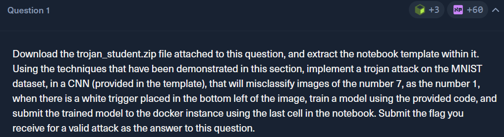

# HackTheBox — Evaluating the Trojan Attack

**Platform:** [HackTheBox Academy](https://academy.hackthebox.com)

**Room:** Trojan Attacks (Evaluating the Trojan Attack)

---

## Overview

A trojan attack embeds malicious behavior inside a model during training. The model behaves normally on clean data, but produces attacker-controlled output when a trigger pattern appears in the input. This makes the attack particularly dangerous — standard evaluation metrics give no indication that anything is wrong.

Implement a trojan (backdoor) attack on a CNN trained on the MNIST dataset. The goal was to make the model misclassify images of digit 7 as digit 1 whenever a specific trigger is present, while maintaining normal accuracy on clean inputs.

It only has one question:

---

## Approach

You can find full code in the file "student_trojan_mnist.ipynb". Basicaly it consists of provided code and compilation of examples in previous sections. It has pretty descriptive comments that explains how everything works.

## High-level code description:

### Step 1 — Environment Setup
Import all required libraries (PyTorch, torchvision, NumPy, etc.), configure the compute device (CUDA/MPS/CPU), and set a fixed random seed to ensure reproducibility.

### Step 2 — Attack Configuration
Define all attack parameters in one place: image size, MNIST normalization constants, source class (7), target class (1), poison rate (10%), trigger size (3×3 pixels), trigger position (bottom-left corner), and training hyperparameters.

### Step 3 — Define Preprocessing Pipeline
Create two separate transforms — transform_base (resize + convert to tensor) and transform_norm (normalize using MNIST mean/std). Keeping them separate allows trigger injection to happen between the two stages.

### Step 4 — Load Datasets
Load four variants of MNIST: clean training set with transform_base, clean test set with both transforms composed, raw test set with transform_base only, and a testloader_clean DataLoader for evaluation.

### Step 5 — Implement the Trigger Function
Define add_trigger() which stamps a small white (value=1.0) square pattern into the bottom-left corner of any image tensor. Includes boundary checks to prevent index errors.

### Step 6 — Build the Poisoned Training Dataset
Implement PoisonedMNISTTrain — a custom PyTorch Dataset class that iterates over clean training data, selects 10% of all digit-7 images, injects the trigger into selected samples, relabels them as digit-1, and applies normalization to all samples.

### Step 7 — Build the Triggered Test Dataset
Implement TriggeredMNISTTest — similar custom Dataset that applies the trigger to all digit-7 test images while keeping their original labels. Used later to measure whether the backdoor activates correctly.

### Step 8 — Create DataLoaders
Wrap poisoned training set and triggered test set into DataLoader objects. Training loader uses shuffle=True, evaluation loaders use shuffle=False.

### Step 9 — Define the CNN Architecture
Define MNIST_CNN — a two-layer convolutional network with max pooling, a fully connected layer with dropout, and a 10-class output. The model itself has no knowledge of the backdoor — it's just a standard classifier.

### Step 10 — Train the Trojan Model
Train the CNN on the poisoned dataset for 5 epochs using Adam optimizer and CrossEntropyLoss. The model simultaneously learns normal digit classification and the backdoor association between the trigger and label 1. Save the trained weights to mnist_cnn_trojaned.pth.

### Step 11 — Evaluate Clean Accuracy (CA)
Run the trained model against the clean normalized test set. Measures whether the model still classifies digits correctly without any trigger — a successful attack must preserve normal accuracy.

### Step 12 — Evaluate Attack Success Rate (ASR)
Run the model against the triggered test set. Measures what percentage of triggered digit-7 images are misclassified as digit-1. High ASR confirms the backdoor is working.

### Step 13 — Submit and Capture the Flag
Send the trained .pth model file to the lab's Docker evaluation endpoint via HTTP POST. The server independently verifies CA and ASR, and returns a flag if both thresholds are met.